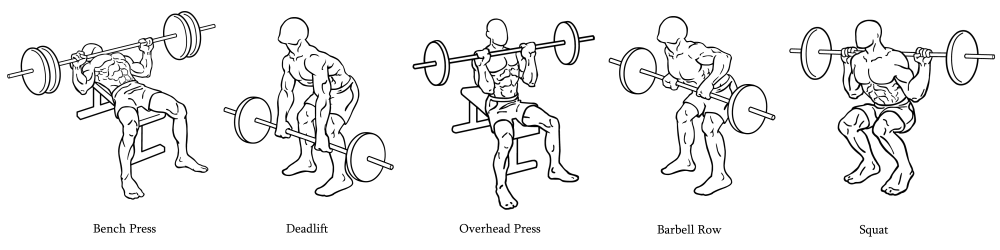
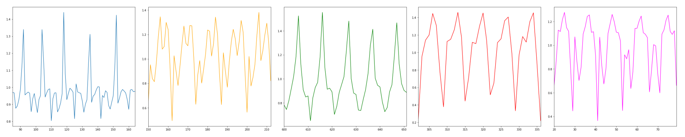

# Tracking Barbell Exercises

This repository provides all the code to process, visualize, and classify accelerometer and gyroscope data obtained from [Mbientlab's WristBand Sensor Research Kit](https://mbientlab.com/). The data was collected during gym workouts where participants were performing various barbell exercises.

#### Exercises



#### Goals
* Classify barbell exercises
* Count repetitions
* Detect improper form


### Project Directory Structure
```

This project follows a standard and organized directory structure to keep all components neatly separated and easily discoverable.

tracking-barbell-exercises
├── .gitignore              
├── environment.yml          # Conda environment definition for reproducible setup of dependencies.
├── README.md                # This file: project overview, setup, and structure.
├── requirements.txt        
├── data/                    # Stores all data relevant to the project. 
│   ├── external/           
│   ├── interim/             # Intermediate data that has been transformed or cleaned.
│   │   ├── 01.processed.pkl # Example of a processed interim data file.
│   │   ├── 02_outliers_removed_chauvenet.pkl
│   │   └── 03_data_features.pkl
│   ├── processed/           
│   └── raw/                 # The original, immutable raw data (e.g., directly from MetaMotion sensor).
│       └── MetaMotion/      # Raw CSV files from MetaMotion sensor.
│           ├── A-bench-heavy_MetaWear_...csv
│           └── ... (all raw MetaMotion CSVs)
├── docs/                   
│   ├── barbell_exercises.png
│   └── graphs.png
├── models/                 
├── notebooks/               # Jupyter notebooks for exploratory data analysis (EDA) 
├── references/             
│   └── folder_structure.txt
├── reports/               
│   └── figures/             # Output figures and plots generated from analyses.
│       ├── Bench (A).png
│       └── ... (all generated plots)
└── src/                     # Source code for the project.
├── init.py         
├── data/                # Scripts for data ingestion and cleaning.
│   ├── make_dataset.py      # Main script to process raw data into usable formats. 
│   └── remove_outliers.py   # Script for outlier detection and removal.
├── features/            # Scripts for feature engineering.
│   ├── build_features.py    # Main script to create features from processed data. (Important)
│   ├── count_repetitions.py # Logic for counting repetitions.
│   ├── DataTransformation.py
│   ├── FrequencyAbstraction.py  
│   └── TemporalAbstraction.py  
├── models/              # Scripts for model training, evaluation, and prediction.
│   ├── LearningAlgorithms.py # Implementations of various learning algorithms.
│   ├── train_model.py       # Main script to train and save models. 
│   └── predict_model.py    
└── visualization/      
└── visualize.py         # Script to generate various plots for analysis and reporting.
```


#### Installation
Create and activate an anaconda environment and install all package versions using `conda install --name <EnvironmentName> --file conda_requirements.txt`. Install non-conda packages using pip: `pip install -r pip_requirements.txt`.


<h2>🛠️ Installation Steps:</h2>

<p>1. Clone the repository:</p>

```
git clone https://github.com/sahilrgiri/tracking-barbell-exercises.git   
cd tracking-barbell-exercises
```

<p>2. Create and activate a new Anaconda environment: bash Copy Edit</p>

```
conda create --name barbell_env python=3.9 conda activate barbell_env
```

<p>3. Install packages from the conda requirements file:</p>

```
conda install --file conda_requirements.txt
```

<p>4. Install additional packages with pip:</p>

```
pip install -r pip_requirements.txt
```


## Make sure to use: 
```
scikit-learn==1.2.1  
numpy>=1.21  
matplotlib>=3.5  
pandas>=1.3
```

#### References
The original code is associated with the book titled "Machine Learning for the Quantified Self"
authored by Mark Hoogendoorn and Burkhardt Funk and published by Springer in 2017. The website of the book can be found on [ml4qs.org](https://ml4qs.org/).


> Hoogendoorn, M. and Funk, B., Machine Learning for the Quantified Self - On the Art of Learning from Sensory Data, Springer, 2017.

